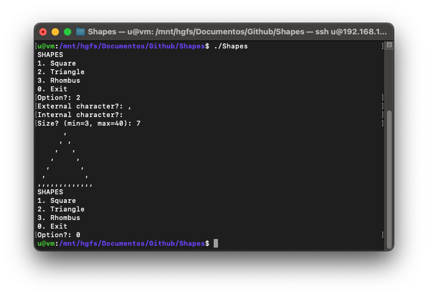

# Shapes

Shapes is a small command line program written in Pascal ISO 10206 (Extended Pascal) that displays a menu in the console where you can request it to draw a square, a triangle, or a rhombus.
You can choose the size, the character for drawing the outline, and the character to fill the interior.

## How to use it
Compile using:

	$ make all

Then execute:

	$ bin/Shapes

## Compilation
Uses GNU Pascal compiler:

	$ make all

Clean files:

	$ make clean

